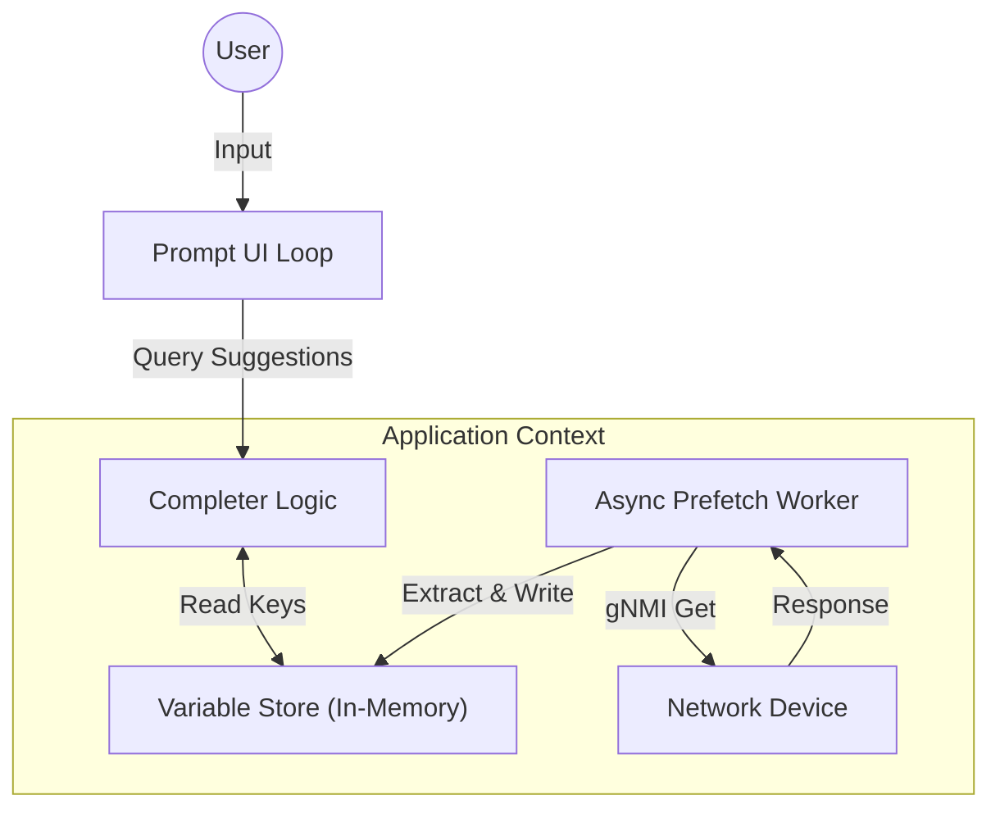

# gnmic Promptモード: 非同期プリフェッチ機能 設計書

## 1. 概要
本機能は、`gnmic prompt` モードにおいて、ユーザーの操作性を向上させるために、ターゲット装置から主要なリソース名（インターフェース名など）を自動的に収集し、コマンド入力時の補完候補（Suggestion）として提供するものである。

### 1.1 背景
現状の `gnmic prompt` モードでは、YANGのパス構造（Schema）の補完は可能だが、実際の値（例: `Ethernet1/1`）は補完されない。そのため、ユーザーは事前に `get` コマンド等で値を調べておくか、正確な名前を記憶している必要があり、UX上の課題となっている。

### 1.2 目的
- ターゲット接続時にバックグラウンドで主要なキー値を取得（Prefetch）する。
- 取得した値をメモリ上のストアに保持し、プロンプトの補完候補として動的に表示する。
- 上記処理をメインスレッド（UI）をブロックせずに行い、軽快な操作感を維持する。

## 2. アーキテクチャ

### 2.1 コンセプト
「セッションスコープ・ステート」 と 「非同期ワーカー」 パターンを採用する。
gnmic 自体はステートレスなCLIツールであるが、prompt モードの実行中のみ有効な一時的な状態（変数ストア）を持たせる。

### 2.2 コンポーネント構成

### 2.3 主要コンポーネント

| コンポーネント | 役割 |
| :--- | :--- |
| **Variable Store** | 取得したキー値をカテゴリ（例: `interface`）ごとに保持するスレッドセーフなインメモリKVS。 |
| **Async Prefetcher** | ターゲット接続時に起動するGoroutine。定義されたパスに対して `Get` を行い、結果を解析して Store に格納する。 |
| **Completer Hook** | ユーザーの入力を監視し、特定のパス（例: `[name=...`）の入力時に Store から候補を検索して表示する。 |

## 3. 詳細設計

### 3.1 データ構造 (Variable Store)
`pkg/app/variables.go` (新規) または `pkg/app/app.go` に配置。
- **構造**: `map[string][]string` をラップした構造体。
    - Key: リソースカテゴリ（例: `interface`, `netinst`）
    - Value: 取得した値のリスト（例: `["Ethernet1/1", "Ethernet1/2"]`）
- **並行性制御**: `sync.RWMutex` を使用し、Prefetcherからの書き込みと、UIスレッドからの読み込みを安全に行う。

### 3.2 非同期プリフェッチロジック (Async Prefetcher)
`pkg/app/prefetch_oc.go` (新規) に実装。

#### 3.2.1 収集対象 (Default OpenConfig Paths)
初期フェーズでは OpenConfig の主要な3リソースに限定して収集する。

| カテゴリキー | gNMI パス | 抽出対象 |
| :--- | :--- | :--- |
| `interface` | `/interfaces/interface/config/name` | `name` leaf |
| `netinst` | `/network-instances/network-instance/config/name` | `name` leaf |

#### 3.2.2 処理フロー
1. **起動**: `runPrompt` 開始時、または `target` 接続確立時に `StartOpenConfigPrefetch` を呼び出す。
2. **並列実行**: 定義されたパスごとに並行（`sync.WaitGroup`利用）して処理を行う。
3. **リクエスト生成**:
    - `DataType`: `CONFIG` (Stateデータは計算負荷が高いため除外)
    - `Encoding`: `JSON`
4. **値の抽出 (`extractLeafValues`)**:
    - `gNMI GetResponse` の `Notification` -> `Update` -> `Val` を走査。
    - `TypedValue` を Go のネイティブ型に変換後、**全て文字列化 (`fmt.Sprintf`)** してリストにする。
5. **保存**: 抽出されたリストが空でなければ `VariableStore` に書き込む。
6. **タイムアウト**: 全体の処理に対してコンテキストによるタイムアウト（例: 30秒）を設定し、ハングアップを防ぐ。

### 3.3 UI統合 (Prompt Integration)
`pkg/app/prompt.go` の修正。

#### 3.3.1 補完ロジック (`completer`)
`go-prompt` の `Completer` 関数内で、現在の入力行（`d.CurrentLine()`）を解析する。
- **トリガー条件**:
    - カーソル直前の単語が、キー入力を求めているコンテキストである場合。
    - OpenConfig パスのパターンマッチング:
        - `.../interface[name=` -> `interface` カテゴリの変数を提示
        - `.../network-instance[name=` -> `netinst` カテゴリの変数を提示
- **表示**:
    - `prompt.Suggest` の `Text` に実際の値、`Description` に "Discovered Interface" 等のメタ情報を設定して返す。

## 4. エラーハンドリングと制約

### 4.1 エラーハンドリング
- **Silent Fail**: プリフェッチ処理の失敗（タイムアウト、権限エラー、パス不在など）は、ユーザーの作業を中断させてはならない。
- **Logging**: 失敗時は `Debug` レベルでログを出力するにとどめ、コンソールへのエラー出力は行わない。

### 4.2 制約事項
- **Configデータのみ**: パフォーマンスへの影響を最小化するため、`state` コンテナのデータは取得しない。
- **静的パス**: 初版では OpenConfig のパスをハードコード（または定数定義）する。ベンダー独自のパス（Native Model）への対応は、将来的な設定ファイル拡張で対応する。
- **リフレッシュ**: 変数の有効期限は `prompt` セッション中のみとする。動的にインターフェースが増減した場合の自動追従は行わない（再起動が必要）。

## 5. テスト・検証環境
本機能の開発および検証には、以下のリソースを使用する。

### 5.1 YANGモデル
- **配置場所**: `./references/public`
- **用途**:
    - `gnmic` の `server` コマンドでモックサーバーを起動する際のスキーマ定義として使用する。
    - 既存のパス補完機能（Schema-based suggestion）と本機能（Value-based suggestion）の併用試験に使用する。

### 5.2 検証手順（例）
1. `gnmic server --yang-path ./references/public ...` でローカルサーバーを起動。
2. `gnmic prompt` で上記サーバーに接続。
3. インターフェース名等の補完候補が表示されることを確認。
